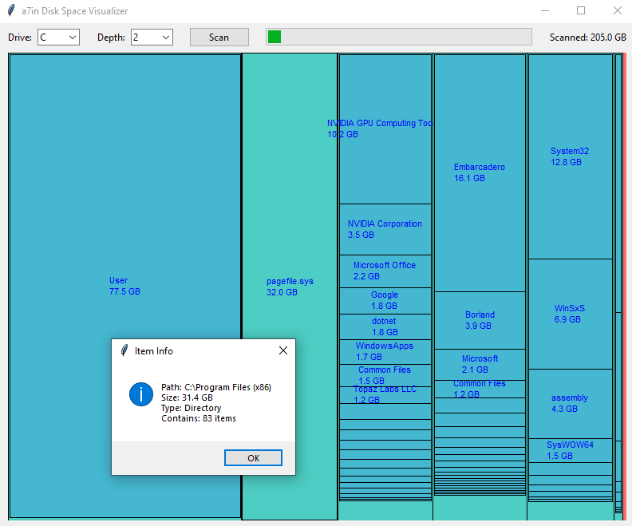

# a7in-disk-space-visualizer
Disk space visualizer.

An analogue of the old utility "Sequoia", which is unable to correctly calculate the amount of space due to symlinks.

# Features
- ignoring symlink folders located on other volumes for correct volume calculation

